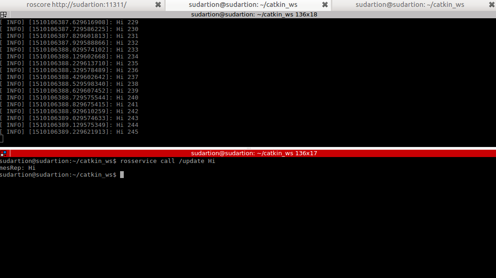

# Beginner Tutorials for ROS 

## Overview

This branch is a continuation of the introduction to ROS and performs beginner tutorials and executes a simple publisher and subscriber implemented in C++. The project involves understanding of ROS topics, nodes, messages and services. The publisher node publishes a modified custom string which is then heard by the subscriber. There also exists a service which allows on to modify the custom string and also the frequency of the nodes. The two nodes can also be called by a launch file.

## To Build

* Creating a catkin workspace:

```
mkdir catkin_ws
cd catkin_ws
mkdir src
catkin_make
```
* Cloning the repository and build:
```
cd catkin_ws
cd src
git clone https://github.com/sudrag/beginner_tutorials.git
cd ..
catkin_make
```

## To run

Running requires multiple terminals to be used,

* In Terminal 1 run:

```
roscore
```

Do not close this terminal 

* In Terminal 2 run:
```
cd catkin_ws
source devel/setup.bash
rosrun beginner_tutorials talker Frequency
```
Here `Frequency` is an integer value provided as an argument to the node and represents the talker frequency rate

The output should be similar to: 

>[ INFO] [1509498746.921039616]: Modified String Inserted :104  
>[ INFO] [1509498747.021040830]: Modified String Inserted :105  
>...

* In Terminal 3 run:
```
cd catkin_ws
source devel/setup.bash
rosrun beginner_tutorials listener
```
The output messages should be similar to:

>[ INFO] [1509498746.921492670]: I heard: [Modified String Inserted :104]  
>[ INFO] [1509498747.021447273]: I heard: [Modified String Inserted :105]  
>...

# Calling the service
* To call the service one most first run the talker and listener nodes following the instructions above. This can be checked by running `rosservice list` which returns a list of services which must contain `update` 
* The service can now be called to change the message to be published using the following commands

```
cd catkin_ws
source devel/setup.bash
rosservice call /update String
```
Here, `String` is the new message to be published

An example can be seen in the image below:




# Using the launch file

* The launch file can be used to run the entire package
* Close all nodes related to the package and follow the steps below

```
cd catkin_ws
source devel/setup.bash
roslaunch beginner_tutorials Week10.launch frequency:=7
```
The argument `frequency` is set to 7 in this case. If this argument is not provided the default frequency is taken to be 10.
This will execute the launch file and run the talker on the current terminal and the listener on a new terminal which pops up.

## Dependencies

* ROS Kinetic
* Catkin
* roscpp package
* std_msgs package
* message_generation package
