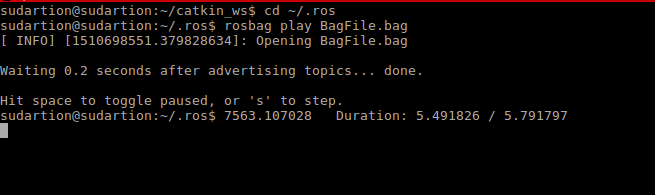

# Beginner Tutorials for ROS 

## Overview

This branch is a continuation of the introduction to ROS and broadcasts a transform frame in the talker. The project involves understanding of ROS bags,topics, nodes, messages and services. An unit test was created to test the talker node and its client . There also exists a service which allows one to modify the custom string and also the frequency of the nodes. The two nodes can also be called by a launch file. The launch file has been modified to record using rosbag which is used to replay topic messages picked up by the listener node.

## To Build

* Creating a catkin workspace:

```
mkdir catkin_ws
cd catkin_ws
mkdir src
catkin_make
```
* Cloning the repository and build:
```
cd catkin_ws
cd src
git clone -b Week11_HW --recursive https://github.com/sudrag/beginner_tutorials.git
cd ..
catkin_make
```

## To run

Running requires multiple terminals to be used,

* In Terminal 1 run:

```
roscore
```

Do not close this terminal 

* In Terminal 2 run:
```
cd catkin_ws
source devel/setup.bash
rosrun beginner_tutorials talker Frequency
```
Here `Frequency` is an integer value provided as an argument to the node and represents the talker frequency rate. If no argument is provided, the default value is taken as 10

The output should be similar to: 

>[ INFO] [1509498746.921039616]: Modified String Inserted :104  
>[ INFO] [1509498747.021040830]: Modified String Inserted :105  
>...

* In Terminal 3 run:
```
cd catkin_ws
source devel/setup.bash
rosrun beginner_tutorials listener
```
The output messages should be similar to:

>[ INFO] [1509498746.921492670]: I heard: [Modified String Inserted :104]  
>[ INFO] [1509498747.021447273]: I heard: [Modified String Inserted :105]  
>...

## Calling the service
* To call the service one most first run the talker and listener nodes following the instructions above. This can be checked by running `rosservice list` which returns a list of services which must contain `update` 
* The service can now be called to change the message to be published using the following commands

```
cd catkin_ws
source devel/setup.bash
rosservice call /update String
```
Here, `String` is the new message to be published

An example can be seen in the image below:


## Using the launch file

* The launch file can be used to run the entire package
* Close all nodes related to the package and follow the steps below

```
cd catkin_ws
source devel/setup.bash
roslaunch beginner_tutorials Week10.launch frequency:=7
```
The argument `frequency` is set to 7 in this case. If this argument is not provided the default frequency is taken to be 10.
This will execute the launch file and run the talker on the current terminal and the listener on a new terminal which pops up.

## Using the Tf library for transforms

The talker node broadcasts a transfrom frame called *talk* with its parent *world* . The transform has a rotation and a translation . The tf tree pdf was added to the repository which can be viewed in the results folder. 

To run this transform . Assuming that the roscore terminal has not been closed still: 

* In terminal 1 run:

```
cd catkin_ws
source devel/setup.bash
rosrun beginner_tutorials talker
```
* In terminal 2 run:
```
rosrun tf tf_echo world talk
```
The output should be similar to:
> At time 1510696389.237
> Translation: [1.000, 1.000, 2.000]
> Rotation: in Quaternion [-0.517, -0.173, 0.809, -0.219]
>            in RPY (radian) [-0.133, 1.150, -2.699]
>            in RPY (degree) [-7.606, 65.916, -154.648]

To view a visual of the frames tree, run the talker node as mentioned above and in a new terminal run:
```
rosrun rqt_tf_tree rqt_tf_tree
```
This output would be similar to:


## To run Test

* An unit test was added to test the talker node which can be run with the launch file. The test creates a client and checks if it was created successfully .To run the test:

```
cd catkin_ws
catkin_make run_tests
```
The output would look like:


## Bag File

* The bag file is made to record all the topics published by the talker and can be run using the same launch file. Assuming the roscore terminal is still running

```
source devel/setup.bash
roslaunch beginner_tutorials Week11.launch StartRec:=true
```
The output would be:


This creates a bag file called *BagFile.bag* in the *.ros* folder. To view the file:

```
cd ~/.ros
rosbag info BagFile.bag
```
This displays the information about the bag file and looks like:


The repository already contains a bag file which was run for approximately 15 seconds.
* To run the nodes without the recording just mention *StartRec:=false* or not providing that argument at all when calling the launch file

## Running the bag file with the listener

The bag file generated can be used as data for the listener . To run this (Assuming roscore is still running) :

* In terminal 1:
```
cd ~catkin_ws
source devel/setup.bash
rosrun beginner_tutorials listener
```

* In terminal 2:
```
cd ~/.ros
rosbag play BagFile.bag
```
The listener will now receive data from the bag file as shown below:




## Dependencies

* ROS Kinetic
* Catkin
* roscpp package
* std_msgs package
* message_generation package
